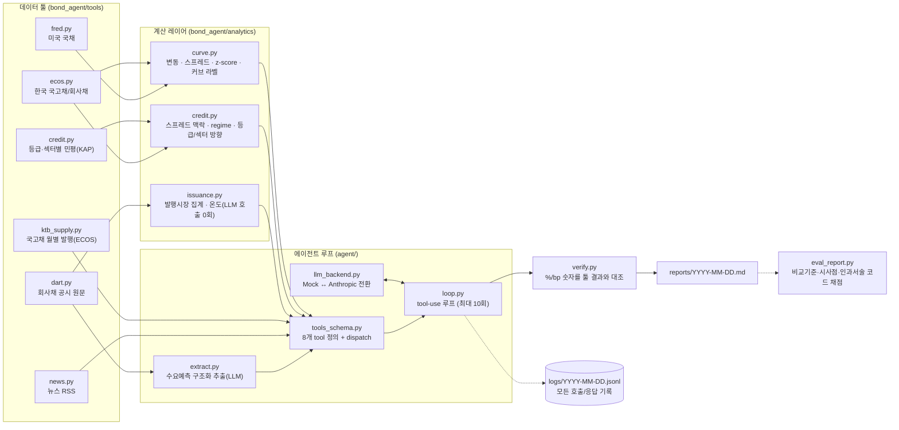

# 데일리 채권시장 브리핑 에이전트

[](https://github.com/qkrtngh915/bond-briefing-agent/actions/workflows/daily_briefing.yml)

국내 자산운용사 채권운용본부용 모닝 브리핑을 매 영업일 아침 자동 생성하는
에이전트. 숫자는 전부 코드로 계산하고, LLM은 "어떤 조사를 할지 판단"과
"서술"만 담당한다.

**최신 리포트**: [reports/2026-09-23.md](reports/2026-09-23.md) (GitHub Actions에서 실제로 생성)

**샘플 리포트**: [이상치가 있던 날 (2026-09-11)](reports/2026-09-11.md) ·
[조용한 날 (2026-09-21)](reports/2026-09-21.md) ·
[크레딧 섹션이 풍부한 날 (2026-09-23)](reports/2026-09-23.md)

## 왜 만들었나

채권운용역의 아침 루틴은 대체로 똑같다 - 밤새 국고채/크레딧 금리가 얼마나
움직였는지 확인하고, 특이한 움직임이 있으면 원인이 될 만한 뉴스를 찾고,
최근 회사채 발행이 있었으면 수요예측 결과를 훑어본다. 이 작업 자체는
반복적이고 데이터 소스가 정해져 있는데, "오늘은 뭘 봐야 하는지"를 매번
사람이 판단해야 해서 완전히 자동화하기는 애매했다. 그래서 데이터 조회와
계산은 코드로 고정하고, "오늘 상황에서 무엇을 더 조사할지"는 에이전트가
판단하게 만들었다 - 조용한 날은 짧게, 이상치가 있는 날은 그 지표에 맞는
조사를 더 하도록.

## 아키텍처



## 설계 포인트

- **숫자는 코드, 해석은 LLM.** `curve.py`가 변동(bp)·스프레드·z-score를 전부
  계산해서 넘기고, LLM은 그 값을 인용/서술만 한다. 프롬프트에도 "스스로
  계산/추정하지 말 것"을 명시했지만, 실제로 미국 금리 변동을 스스로 계산해서
  쓴 사례가 있었다 (아래 "실전 검증" 참고) - 프롬프트만으로는 완벽히 막을 수
  없어서 검증 레이어가 필요했다.
- **verify.py가 마지막 안전망.** 리포트 텍스트에서 %/bp 숫자를 정규식으로
  뽑아 이번 실행에서 실제로 호출한 툴 결과(숫자형 필드는 물론, 뉴스 제목
  같은 문자열 안에 박힌 숫자까지)와 대조한다. 불일치하면 리포트 하단에
  경고 섹션을 붙인다 - 모델을 막지는 못해도, 사람이 검증 없이 그대로 믿고
  넘어가는 걸 막는다.
- **z-score 기반 조건부 추가 조사.** 매번 호출하는 툴은
  `get_market_snapshot`/`get_anomalies`(시황) + `get_credit_snapshot`/
  `get_issuance_market_summary`/`get_bond_demand_forecasts`(크레딧 섹션) +
  `get_ktb_supply`(국채수급 섹션) 여섯 개다. `get_us_yields`/`search_news`만
  조건부다 - `get_anomalies`가 |z|>2인 지표를 하나도 못 찾으면 뉴스 검색
  없이 짧게 끝나고, 이상치가 있으면 그 지표 종류(국고채 커브 / 크레딧
  스프레드 / 한미 금리차)에 맞는 검색어로 `search_news`를 호출한다.
  자세한 비교는 [docs/agent_decision_comparison.md](docs/agent_decision_comparison.md)
  (Phase E 이전 기록이라 옛 5-섹션/2-필수툴 기준이지만, 조건부 판단 패턴
  자체는 그대로 유지됨).
- **전 과정 로그.** 모든 tool_call/tool_result/model_response가
  `logs/YYYY-MM-DD.jsonl`에 한 줄씩 남는다 - 에이전트가 어떤 순서로 어떤
  판단을 했는지 나중에 그대로 재구성할 수 있다.
- **해석 라벨도 코드가 고정한다.** 커브 방향(불/베어) × 기울기(스티프닝/
  플래트닝), 크레딧 스프레드 regime(타이트/중립/와이드, 1년치 percentile
  기준), 등급간/섹터간 스프레드 확대·축소, 발행시장 온도(강세/중립/약세)
  전부 `bond_agent/config.py`의 임계값으로 코드가 판정해서 넘긴다. LLM은
  이 라벨을 그대로 인용만 하고 "이 정도면 스티프닝이네요" 식으로 재판정하지
  않는다 - "숫자는 코드, 해석은 LLM" 원칙을 라벨까지 확장한 것.
- **모든 숫자에 비교 기준을 강제한다.** 시스템 프롬프트가 "전일/전주/
  percentile 중 최소 하나"를 모든 숫자에 요구한다. `scripts/eval_report.py`로
  실제 이 비교 기준이 있는 문장의 비율을 코드로 측정해서 Before/After를
  검증했다 (아래 "리포트 품질 평가" 참고).

## 에이전트 판단 과정 예시

이상치가 있는 날(2026-09-11)과 없는 날(2026-09-21)에 실제로 다른 경로를
타는지 실행해서 비교했다:

| | 이상치 있는 날 | 이상치 없는 날 |
|---|---|---|
| 호출한 툴 | market_snapshot → anomalies → search_news×2(지표별 검색어) → bond_demand_forecasts | market_snapshot → anomalies → bond_demand_forecasts |
| 턴 수 | 4 | 3 |
| 리포트 | 이상치 3개 + 원인 후보 뉴스 포함, 길다 | "특이사항 없음" 한 줄, 짧다 |

지표 종류에 따라 검색어도 실제로 달라졌다: 국고채 커브 이상치 →
"국고채 금리", 크레딧 스프레드 이상치 → "회사채 크레딧 스프레드". 자세한
내용과 실행 중 발견한 문제는 [docs/agent_decision_comparison.md](docs/agent_decision_comparison.md) 참고.

## 실전 검증에서 잡은 버그

전부 실제 API/실제 공시/실제 모델로 돌려보다가 발견해서 코드나 프롬프트로
고친 것들이다 (가짜 데이터 단위 테스트로는 못 잡았을 종류의 문제들):

| 문제 | 원인 | 해결 |
|---|---|---|
| DART 공시 목록에 회사채가 아닌 것들이 대량 섞여 나옴 | `pblntf_detail_ty=C002`가 증권사 ELS/DLS 발행실적보고서·투자설명서까지 포함 (56일치 2,736건) | 전체 페이지네이션 후 `report_nm`에 "증권신고서"가 실제로 있는 것만 필터링 |
| 수요예측 결과 섹션 추출이 엉뚱한 곳을 집음 | "수요예측" 첫 등장 지점이 실제로는 정정사항 "목록"의 제목이었음 | "경쟁률" 등장 지점을 우선하고, 그중 "수요예측결과" 표제가 앞에 있는 것을 우선 (비교 발행내역 표의 "경쟁률"과 구분) |
| 검증 레이어가 정상적으로 인용된 숫자를 오탐 | 뉴스 헤드라인의 숫자("5.44%")가 문자열 필드에 있어서, 숫자형 필드만 훑는 대조 로직이 못 찾음 | 문자열 값 안에 박힌 %/bp 숫자도 대조 대상에 포함 |
| 모델이 미국 금리 변동을 스스로 계산해서 씀 | `get_us_yields`는 레벨만 주고 전일 대비 변동을 제공하는 툴이 없어서, 모델이 두 레벨을 직접 빼서 "-5bp"를 만들어냄 | 프롬프트에 "미국 금리는 레벨로만 언급, 변동폭 직접 계산 금지" 명시 |
| 다중 회차 공시에서 모집금액이 10배 축소됨 | "이백일십억원(₩21,000,000,000)"을 210억이 아니라 21억으로 환산 | 처음엔 프롬프트로 고쳤다가, 재발 방지 차원에서 아예 LLM은 원문 숫자+단위만 추출하고 억원 환산은 코드(`_to_eok_won`)가 하도록 구조 변경 |
| (선택 툴로 분류된) `get_bond_demand_forecasts`를 호출 안 하고 "최근 발행 없음"이라 근거 없이 씀 | 이상치가 없는 날 모델이 이 툴을 완전히 스킵 - 숫자가 아니라 verify.py도 못 잡는 환각 | 이 툴은 이상치 유무와 무관하게 섹션 6 작성 시 항상 호출하도록 재분류 |
| `get_bond_demand_forecasts` 한 번 호출이 실제 LLM 호출을 수십 회 유발 | 필링 1건당 `extract_filing` 1회를 호출하는데, 5일 조회에도 증권신고서/정정신고서가 20건 넘게 잡히는 경우가 있음(실측: 2026-09-11 기준 22건) | `data/extracted/{rcept_no}.json`에 추출 결과를 영구 캐시하고, 캐시에 없는("신규") 공시만 실행당 5건으로 제한 (캐시된 건은 상한과 무관하게 전부 포함) |

## 데이터 소스

| 영역 | 소스 | 비고 |
|---|---|---|
| 국고채/회사채 금리 | ECOS(한국은행) 817Y002/722Y001 | 통계표/항목 코드는 `scripts/lookup_ecos_codes.py`로 실제 조회해서 확정 |
| 미국 국채/SOFR | FRED | 레벨만 제공 (전일 대비는 계산 안 됨 - 프롬프트로 직접 계산 금지 명시) |
| 뉴스 | 연합뉴스/한국경제 RSS | 제목+요약만, 최근 항목 한정 |
| 회사채 수요예측 | OpenDART 증권신고서 원문 + LLM 구조화 추출 | 결과는 `data/extracted/`에 영구 캐시 |
| 등급/섹터별 민평 스프레드 | KAP(한국자산평가) 공개 AJAX(`koreaap.com`) | KOFIA 자체 사이트는 죽은 legacy frameset이라 대체 소스로 발견 (Phase 1-1) |
| 국고채 월별 발행 실적 | ECOS 191Y001(항목 0200000) | 개별 입찰 낙찰금리/응찰률은 이 표에 없음 - 아래 한계 참고 |

### 조사했지만 못 쓴 소스 (fallback 없이 스킵)

- **국고채 개별 입찰 결과(낙찰금리/응찰률/tail)**: 1차 후보
  `ktb.moef.go.kr`(기획재정부)는 페이지가 이름 없는 범용 JS로 데이터를
  주입해서 데이터 엔드포인트를 특정하지 못함. 2차 후보 data.go.kr의
  관련 데이터셋은 `fileData` 유형이라 별도 API 키 신규 등록이 필요해서
  보류. 최종적으로 ECOS 191Y001(월별 발행 실적)만 fallback으로 채택.
- **외국인 채권 수급**: 1차 후보 KRX(`data.krx.co.kr`)는 최근 "Data
  Marketplace" 개편 이후 데이터 조회 API(`getJsonData.cmd`) 자체가 로그인
  세션을 요구하도록 바뀐 것을 실제 요청으로 확인함(이 프로젝트는 로그인이
  필요한 데이터는 쓰지 않는다는 원칙). 2차 후보 금투협
  FreeSIS(`freesis.kofia.or.kr`)는 컴파일된 엔터프라이즈 JS 프레임워크로
  렌더링돼 역공학이 사실상 불가능. 두 후보 모두 막혀서 **외국인 수급은
  이 에이전트에 전혀 없다** - 리포트에도 이 사실을 그대로 명시한다.
  자세한 조사 기록은 [WORK_LOG.md](WORK_LOG.md) Phase 2 참고.

## 리포트 품질 평가

`scripts/eval_report.py`가 LLM 호출 없이 리포트 텍스트 + 실행 로그만으로
4가지를 코드로 채점한다: 비교 기준 없는 숫자 비율, 섹션별 "운용 시사점"
누락 여부, 근거 없는 인과 서술 개수, `verify.py` 불일치 개수. 이 평가
방식으로 Before(Phase 0 이전 리포트)/After(Phase 1~3 반영 후 실제 Haiku로
재생성)를 같은 3개 날짜로 비교했다:

| 날짜 | 비교기준 없는 숫자 | 크레딧 섹션 | 국채수급 섹션 |
|---|---|---|---|
| 2026-09-23 before | 23.1% | 표만 있고 등급/섹터 평균·percentile 없음 | 섹션 자체 없음 |
| 2026-09-23 after | 10.0% | 등급/섹터 스프레드 + percentile + regime + 발행시장 온도 + 운용 시사점 | 신설 (월 발행액 YoY, 외국인 수급 데이터 없음을 명시) |

자세한 지표 비교, 크레딧 섹션 정성 비교, 그리고 이번에 새로 발견됐지만
아직 안 고친 한계(Haiku가 가끔 "## 1."로 바로 시작하라는 지시를 어기고
서두 문장을 붙이는 문제, 뉴스 근거가 있어도 과잉 해석을 덧붙이는 경향)는
[docs/quality_before_after.md](docs/quality_before_after.md)에 정리했다.

## 한계

- **원문 섹션 탐지는 완벽한 파서가 아니라 휴리스틱이다.** 회사/공시 서식이
  다양해서 새로운 형태의 공시에서 또 틀릴 수 있다.
- **다중 회차 추출은 한 공시 안에서만 분리한다.** 서로 다른 공시에 걸쳐
  같은 회사의 같은 채권이 여러 번 언급되는 경우(정정 → 발행조건확정)를
  하나로 묶어주지는 않는다.
- **한글 숫자/금액 환산은 여전히 모델이 읽는 것에 의존한다.** 이번에 한
  가지 패턴(괄호 안 원화 숫자)의 오류는 고쳤지만, 다른 표기 방식에서 같은
  종류의 오류가 또 날 수 있다 - 숫자는 항상 원문과 대조해야 한다.
- **verify.py는 %/bp가 붙은 숫자만 검사한다.** z-score를 단위 없이 쓰거나,
  "최근 발행 없음"처럼 숫자가 아닌 근거 없는 주장은 못 잡는다 (위 표의
  마지막 항목처럼, 이런 건 프롬프트로 막아야 한다).
- **뉴스 검색은 연합뉴스/한국경제 RSS 최근 항목에 한정.** 오래된 과거
  날짜를 조회하면 그 시점 뉴스가 이미 피드에서 밀려나 빈 결과가 나올 수 있다.
- **GitHub Actions 워크플로는 실제로 실행해보지 않았다.** 로컬에서 YAML
  문법과 구조, 크론의 UTC↔KST 매핑만 검증했다 (원격 저장소가 없어서 실제
  Actions 실행 자체는 못 함).
- **외국인 채권 수급 데이터가 아예 없다.** 위 "조사했지만 못 쓴 소스"
  참고 - KRX는 로그인 필요, 금투협 FreeSIS는 역공학 불가라 fallback 없이
  스킵했다. 국채수급 섹션은 국고채 월별 발행 실적(YoY)만 다룬다.
- **국고채 개별 입찰 결과(낙찰금리/응찰률/tail)도 없다.** ECOS 191Y001은
  월별 발행 실적/잔액만 주고 개별 입찰 상세는 없다. 이 데이터가 필요하면
  기획재정부 공식 발표나 유료 단말을 직접 확인해야 한다.
- **크레딧 스프레드 percentile의 lookback이 스펙(1년)보다 짧다.**
  252영업일 순차 조회가 브리핑 1회당 4분+ 걸려서, 실제로는 60영업일(약
  3개월) 기준으로 계산한다 - 리포트 문구도 "최근 약 3개월 기준"이라고
  명시하도록 프롬프트에 못박아뒀다.
- **Haiku가 가끔 출력 형식 지시를 어긴다.** "최종 답변은 '## 1.'로 바로
  시작하라"는 명시적 규칙이 있는데도, 실제 실행에서 서두 문장이 붙는
  사례가 나왔다. 근거 없는 인과 서술 금지 규칙도 완전히는 안 지켜진다
  (뉴스 근거가 있어도 그 근거가 뒷받침하지 않는 해석을 덧붙이는 경우가
  있음). 자세한 내용은 [docs/quality_before_after.md](docs/quality_before_after.md)
  참고.

## 설치 및 실행

```bash
python -m pip install -r requirements.txt
cp .env.example .env   # ECOS_API_KEY, FRED_API_KEY, DART_API_KEY, ANTHROPIC_API_KEY 채우기

# 숫자만 표로 확인 (LLM 호출 없음, 비용 없음)
python scripts/demo_today.py

# 에이전트 루프 실행 -> reports/YYYY-MM-DD.md 생성
python scripts/run_briefing.py                                    # LLM_BACKEND=mock(기본값), 비용 없음
LLM_BACKEND=anthropic python scripts/run_briefing.py 2026-09-23    # 실제 모델 호출, 비용 발생

# 최근 회사채 수요예측 공시 원문+추출결과 나란히 보기 (DART_API_KEY 필요)
python scripts/review_bond_extractions.py

# 최근 N일 공시 추출을 미리 캐시에 채워두기 (기본 --dry-run: 대상 건수만 출력, 비용 없음)
python scripts/backfill_extract.py --days 14
python scripts/backfill_extract.py --days 14 --no-dry-run   # 실제로 채움, 비용 발생

# 생성된 리포트 품질을 코드로만 채점 (LLM 호출 없음, 비용 없음)
python scripts/eval_report.py 2026-09-23

# 테스트 (ECOS/FRED/뉴스/KAP/ECOS(191Y001) 스모크 테스트는 .env 키 필요. 나머지는 Mock/가짜 데이터라 비용 없음)
python -m pytest tests/ -v
```

`get_bond_demand_forecasts`가 추출한 결과는 `data/extracted/{rcept_no}.json`에
영구 캐시된다 - 같은 공시를 다시 만나면 실제 LLM을 호출하지 않고 캐시를
그대로 쓴다. 캐시에 없는("신규") 공시만 한 번 호출당 최대 5건까지 추출하고,
그 이상은 다음 실행에서 처리한다 (캐시된 건은 이 상한과 무관하게 항상 전부
포함). 캐시는 `agent/extract.py`의 `EXTRACT_PROMPT_VERSION`을 저장해두고,
그 값이 바뀌면(추출 스키마/프롬프트 변경) 자동으로 무효화되어 재추출한다.
이 캐시는 `.gitignore`에 없다 - GitHub Actions가 매번 새 checkout이라,
캐시를 커밋하지 않으면 "영구" 캐시가 매일 사라지기 때문이다.

`.env`의 `ECOS_API_KEY`/`FRED_API_KEY`/`DART_API_KEY`는 각각
[ecos.bok.or.kr](https://ecos.bok.or.kr) · [FRED](https://fred.stlouisfed.org/docs/api/api_key.html) ·
[opendart.fss.or.kr](https://opendart.fss.or.kr) 에서 무료로 발급받는다.
`ANTHROPIC_API_KEY`는 [console.anthropic.com](https://console.anthropic.com)에서
발급받고, `LLM_BACKEND=anthropic`일 때만 필요하다 (비용 발생).

### 폴더 구조

```
bond_agent/
  tools/         ecos.py, fred.py, news.py, dart.py, credit.py(KAP), ktb_supply.py(ECOS),
                 calendar.py, _cache.py
  analytics/     curve.py (변동/스프레드/이상치/커브 라벨), credit.py (스프레드 맥락/regime),
                 issuance.py (발행시장 집계, LLM 호출 0회)
  config.py      경로, API 키, ECOS 코드, LLM_BACKEND, 코드 라벨 임계값
agent/
  prompts.py, llm_backend.py, tools_schema.py(8개 tool), loop.py, extract.py, verify.py
scripts/         demo_today.py, run_briefing.py, review_bond_extractions.py,
                 check_business_day.py, lookup_ecos_codes.py, generate_extract_check.py,
                 backfill_extract.py, eval_report.py
tests/           각 모듈별 단위/스모크 테스트
docs/            extract_check.md, agent_decision_comparison.md, quality_baseline.md,
                 quality_before_after.md (Before/After 실측), before_reports/, before_logs/
.github/workflows/daily_briefing.yml   매 평일 07:30 KST 자동 실행
data/cache/      API 응답 캐시 (당일 무효화, dart/ 하위는 원문 영구 캐시)
data/extracted/  DART 추출 결과 영구 캐시 (rcept_no별, git에 커밋됨)
logs/, reports/
WORK_LOG.md      단계별 진행/판단 기록 (애매한 의사결정의 근거)
SECURITY_CHECK.md  git 히스토리 API 키 유출 점검 기록
```

## 로드맵

앞으로의 확장 방향은 [ROADMAP.md](ROADMAP.md)에 정리했다.
